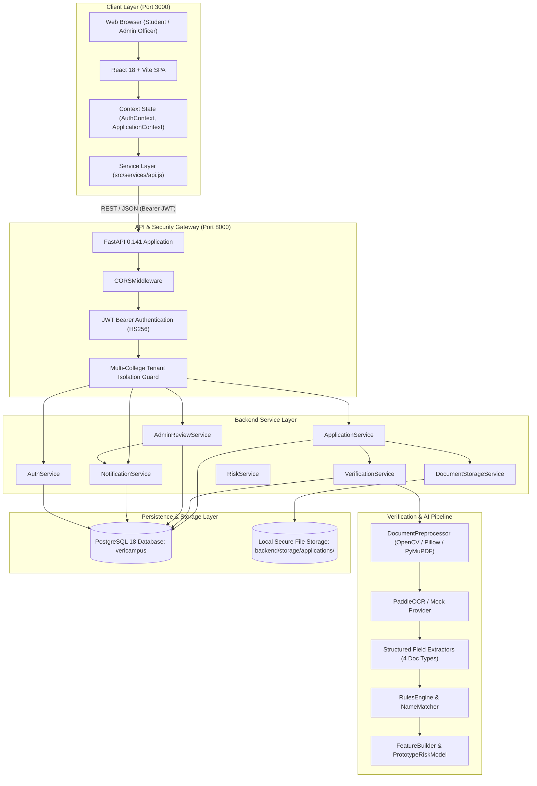
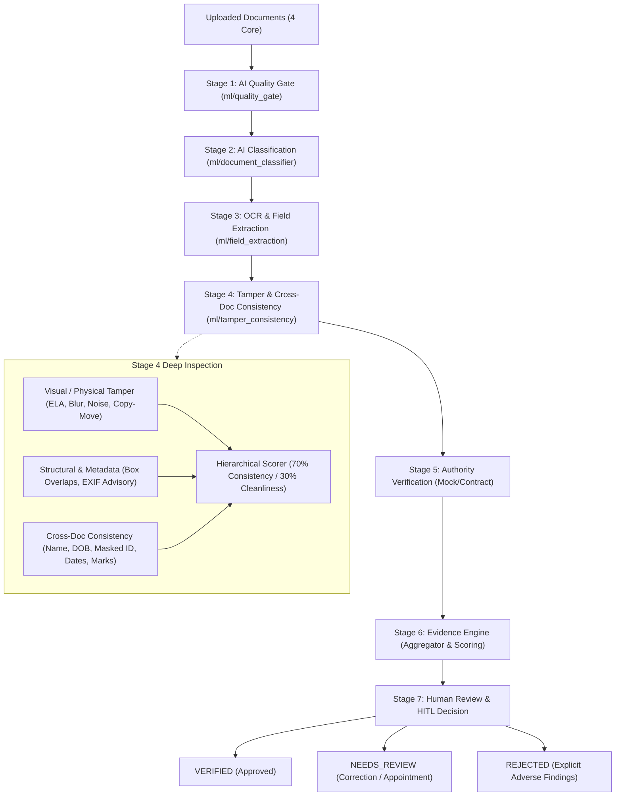
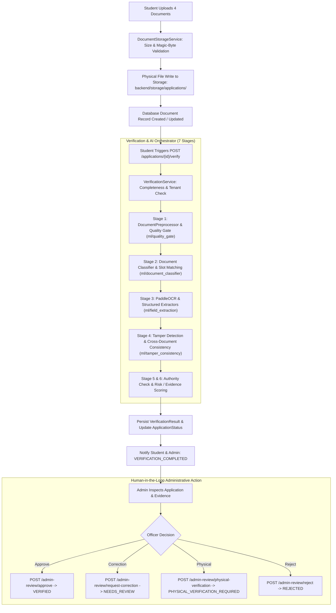
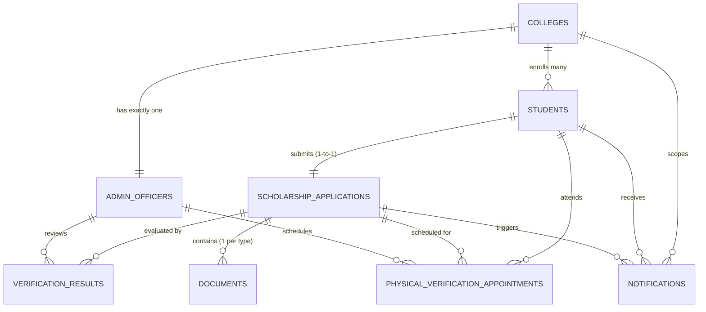
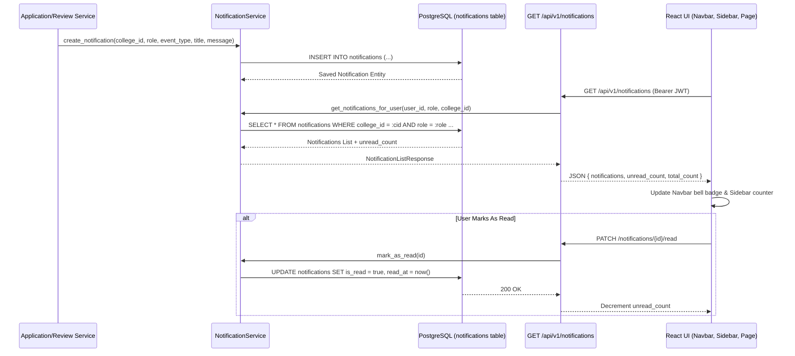
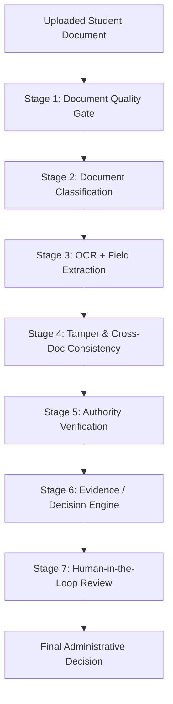

# VeriCampus AI — System Architecture Specification

**Document Version:** 1.0.0  
**Status:** Approved / Active Baseline  
**Project Path:** `C:\veriicampus prerequisites`  
**Last Updated:** September 2026  

---

## 1. High-Level System Architecture

VeriCampus AI follows a modern decoupled client-server architecture. The frontend is a Single-Page Application (SPA) built with React 18, Vite 5, and Tailwind CSS. The backend is a high-performance RESTful service implemented in Python using FastAPI, SQLAlchemy 2.0 ORM, and PostgreSQL 18.



---

## 2. Frontend Architecture (React + Vite)

### 2.1 Technology Stack
- **Framework & Bundler:** React 18.2.0 with Vite 5.1.6
- **Styling:** Tailwind CSS 3.4.1 (Ocean Depths custom theme palette)
- **Routing:** React Router DOM 6.22.3
- **Iconography:** Lucide React 0.344.0
- **Development Port:** `http://localhost:3000` (configured in `vite.config.js`)

### 2.2 Directory Structure
```
src/
├── App.jsx                     # Route declarations and layout guards
├── main.jsx                    # Root entry point with context providers
├── index.css                   # Tailwind imports and base directives
├── components/
│   ├── AIProcessingStepper.jsx # Visual multi-step verification animation
│   ├── DashboardCard.jsx       # Reusable metrics/summary card
│   ├── DashboardLayout.jsx     # Master authenticated layout with Navbar & Sidebar
│   ├── DocumentCard.jsx        # Core card for file upload, preview, and replacement
│   ├── MeetingSchedulerModal.jsx # Admin modal for physical verification scheduling
│   ├── Navbar.jsx              # Top navigation with role badge, alerts, and logout
│   ├── Sidebar.jsx             # Left navigation with unread badge counters
│   └── StatusBadge.jsx         # Universal status tag renderer across all 18 statuses
├── context/
│   ├── AuthContext.jsx         # JWT, current user profile, role, login/logout
│   └── ApplicationContext.jsx  # Applications, verification results, notifications
├── pages/
│   ├── LandingPage.jsx         # Public portal entry with role selection
│   ├── StudentLogin.jsx        # Student login view
│   ├── StudentRegister.jsx     # Student registration view with college code
│   ├── AdminLogin.jsx          # Admin login view (college code + email + password)
│   ├── AdminRegister.jsx       # Admin registration view via setup code
│   ├── student/
│   │   ├── StudentDashboard.jsx       # Application summary, correction banner, alerts
│   │   ├── SelectScholarshipPage.jsx  # MahaDBT scheme catalog selection
│   │   ├── DocumentUploadPage.jsx     # 4-core document upload and replacement grid
│   │   ├── VerificationResultPage.jsx # OCR extractions, check matrix, risk summary
│   │   ├── StudentAppointmentPage.jsx # Physical verification details & checklist
│   │   └── StudentNotificationsPage.jsx # Chronological alert timeline & read toggles
│   └── admin/
│       ├── AdminDashboard.jsx         # Institution caseload metrics and quick actions
│       ├── ApplicationsListPage.jsx   # College application queue with search/filter
│       ├── ApplicationDetailPage.jsx  # Complete audit, OCR inspection, and HITL actions
│       ├── AdminAppointmentsPage.jsx  # College scheduled physical appointments queue
│       └── AdminNotificationsPage.jsx # College audit alerts log and bulk mark-read
└── services/
    └── api.js                  # Centralized HTTP client, auth headers, and blob streaming
```

### 2.3 Routing & Route Guards
All routes are declared in `src/App.jsx`:
1. **Public Routes:**
   - `/` — Landing page with dual role entry cards.
   - `/student-login`, `/student-register` — Student authentication.
   - `/admin-login`, `/admin-register` — Administrator authentication.
2. **Protected Student Routes:**
   - Wrapped by `<DashboardLayout requiredRole="STUDENT" />`.
   - Checks `token` and `role === 'STUDENT'`. Unauthenticated or invalid roles redirect to `/student-login`.
   - Routes: `/student/dashboard`, `/student/select-scholarship`, `/student/documents`, `/student/verification`, `/student/appointment`, `/student/notifications`.
3. **Protected Admin Routes:**
   - Wrapped by `<DashboardLayout requiredRole="ADMIN" />`.
   - Checks `token` and `role === 'ADMIN'`. Unauthenticated or invalid roles redirect to `/admin-login`.
   - Routes: `/admin/dashboard`, `/admin/applications`, `/admin/applications/:id`, `/admin/appointments`, `/admin/notifications`.

### 2.4 State Management & Context Architecture
- **`AuthContext.jsx`:**
  - Persists `vericampus_token`, `vericampus_user`, and `vericampus_role` in `localStorage`.
  - Exposes `login(token, user, role)`, `logout()`, `currentUser`, `role`, `token`, and `isAuthenticated`.
- **`ApplicationContext.jsx`:**
  - Synchronizes applications (`applications`, `myApplication`), verification results, and database notifications (`notifications`, `unreadCount`).
  - Provides `fetchApplications()`, `fetchNotifications()`, `markNotificationAsRead(id)`, `markAllNotificationsAsRead()`, and `refreshState()`.
  - Automatically loads contextual records upon user login and updates badge counts across `Navbar` and `Sidebar`.

### 2.5 Secure Document Blob Streaming
To ensure internal storage paths are never leaked to client browsers and to prevent cross-origin authorization bypasses:
1. Client requests document binary via `api.fetchDocumentBlob(appId, docId, token)`.
2. Request connects to `GET /api/v1/applications/{app_id}/documents/{doc_id}/file` with Bearer JWT and `cache: 'no-store'`.
3. Server streams raw file bytes with `Content-Type: application/pdf` or `image/jpeg`.
4. Client converts response to in-memory blob URL via `URL.createObjectURL(blob)`.
5. Document renders directly in browser modal or iframe.
6. Blob URLs are revoked when components unmount, freeing browser memory.

---

## 3. Backend Architecture (FastAPI + SQLAlchemy)

### 3.1 Technology Stack
- **Framework:** FastAPI 0.141 running on Uvicorn ASGI
- **Language:** Python 3.14
- **ORM:** SQLAlchemy 2.0.54 (Declarative Mapped syntax)
- **Database Driver:** Psycopg 3.3.5 (PostgreSQL native binary)
- **Migrations:** Alembic 1.20.0
- **Validation:** Pydantic v2.13.5 & Pydantic Settings
- **Security:** PyJWT 2.14.0 (HS256) & Passlib / Bcrypt 5.0.0
- **Development Port:** `http://localhost:8000`

### 3.2 Backend Directory Structure
```
backend/
├── alembic/                    # Migration scripts and environment configuration
│   ├── env.py
│   └── versions/
│       ├── 001_initial_schema.py
│       ├── 2416706cec79_add_authentication_fields_to_student_.py
│       ├── d0c676a58d4b_add_multi_college_support.py
│       ├── e1f2a3b4c5d6_add_admin_setup_code.py
│       ├── f2a3b4c5d6e7_add_app_and_doc_constraints.py
│       └── b3c4d5e6f7a8_add_notifications_table.py
├── alembic.ini
├── requirements.txt
├── storage/                    # Local filesystem document repository
│   └── applications/
└── app/
    ├── main.py                 # FastAPI application factory, CORS, health route
    ├── api/
    │   ├── router.py           # Master API router (/api/v1 prefix)
    │   └── v1/
    │       ├── auth.py         # Student & Admin auth endpoints
    │       ├── admin.py        # College code management
    │       ├── applications.py # Applications, documents, verification, and review
    │       └── notifications.py# Notification retrieval and read tracking
    ├── core/
    │   ├── config.py           # Pydantic Settings (DB URL, JWT secrets, limits)
    │   ├── dependencies.py     # Auth token extractors and role dependencies
    │   └── security.py         # Bcrypt hashing and JWT token creation/decoding
    ├── db/
    │   ├── base.py             # SQLAlchemy DeclarativeBase
    │   ├── session.py          # SessionLocal and get_db dependency
    │   ├── seed.py             # Seed data for DEMO001 and DEMO002
    │   └── models/             # SQLAlchemy ORM Entities
    ├── schemas/                # Pydantic serialization and request models
    └── services/               # Business logic and domain service layer
        ├── auth_service.py
        ├── application_service.py
        ├── document_storage_service.py
        ├── admin_review_service.py
        ├── notification_service.py
        ├── verification/
        │   ├── base.py         # BaseAIVerifier abstract contract
        │   ├── mock_verifier.py# Mock deterministic extraction provider
        │   ├── paddle_verifier.py # Real PaddleOCR verifier pipeline
        │   ├── rules_engine.py # MahaDBT eligibility and NameMatcher engine
        │   ├── verification_service.py # Orchestrator and DB persistence
        │   ├── document_preprocessor.py # Image deskewing/filtering
        │   ├── ocr/            # OCR engine interfaces
        │   └── extractors/     # Document-specific regex and text extractors
        └── risk_analysis/
            ├── base.py         # BaseRiskModel contract
            ├── schemas.py      # Risk features and prediction schemas
            ├── feature_builder.py # Non-PII feature extractor
            ├── risk_model.py   # Prototype rule-based risk model
            └── risk_service.py # Risk analysis coordinator
```

### 3.3 Security, JWT Claims & Dependencies
- **JWT Payload Structure:**
  ```json
  {
    "sub": "c9bf9e57-1685-4c89-bafb-ff5af830be8a",
    "role": "STUDENT",
    "college_id": "3649c76f-9e0b-4dd7-b971-117348dc83e5",
    "email": "student@example.edu",
    "exp": 1727000000
  }
  ```
- **Dependencies (`app/core/dependencies.py`):**
  - `get_current_token_payload`: Validates Bearer token header, decodes HS256 signature, ensures token is unexpired, and returns `TokenPayload`.
  - `require_admin_user`: Enforces that `payload.role == UserRole.ADMIN`, returning `HTTP 403 Forbidden` if invoked by a student.

---

## 4. End-to-End Verification Pipeline & 7-Stage ML Architecture

### 4.1 Seven-Stage Verification Lifecycle

The platform executes a modular 7-stage verification lifecycle designed to automate clerical inspection while ensuring explainable, non-punitive human-in-the-loop (HITL) administrative oversight:





### 4.2 ML Package Directory Structure
```
ml/
├── quality_gate/               # Stage 1: Document Quality Gate
│   ├── config.py               # Blur, glare, DPI, contrast thresholds
│   ├── schemas.py              # QualityAssessment, QualityMetrics
│   ├── detector.py             # Laplacian blur, brightness, aspect ratio
│   └── service.py              # Gate evaluation (PASS, WARNING, FAIL)
├── document_classifier/        # Stage 2: Document Classification
│   ├── config.py               # Confidence thresholds and class weights
│   ├── schemas.py              # DocumentClassificationResult
│   ├── features.py             # Layout & text feature extraction
│   ├── model.py                # Classifier model abstractions
│   └── service.py              # Slot-type matching & misclassification routing
├── field_extraction/           # Stage 3: OCR + Field Extraction
│   ├── config.py               # Completeness & confidence thresholds
│   ├── schemas.py              # FieldExtractionResult, SubjectScore
│   ├── normalizers.py          # Type-safe name, date, currency, masked ID
│   ├── aliases.py              # Multilingual synonym dictionaries
│   ├── extractors/             # Government ID, Marksheet, Income, Domicile
│   └── service.py              # Extraction orchestrator with Stage 1/2 gating
└── tamper_consistency/         # Stage 4: Tamper Detection & Cross-Doc Consistency
    ├── config.py               # Thresholds, evidence weights, software strings
    ├── schemas.py              # TamperSignal, ConsistencyCheckResult, Stage4Result
    ├── base.py                 # BaseTamperDetector, BaseConsistencyChecker
    ├── consistency/            # Semantic cross-document consistency checkers
    │   ├── name_consistency.py # Normalized token & phonetic matching
    │   ├── dob_consistency.py  # ISO YYYY-MM-DD date matching
    │   ├── id_consistency.py   # Masked Government ID matching
    │   ├── date_consistency.py # Temporal chronology & age sanity
    │   └── marks_consistency.py# Subject sum vs total & percentage arithmetic
    ├── tamper/                 # Physical, structural, and metadata detectors
    │   ├── visual_features.py  # ELA, blur variance, noise variance, copy-move
    │   ├── structural_features.py # Bounding box overlap IoU & aspect ratio
    │   ├── metadata_features.py   # Advisory EXIF/PDF editing software check
    │   └── heuristic_detector.py  # Tamper detection aggregator
    ├── features.py             # Normalized tabular feature vector builder
    ├── scorer.py               # Hierarchical scorer (70% consistency / 30% cleanliness)
    └── service.py              # Stage 4 verification orchestrator
```

### 4.3 Stage 1: AI Document Quality Gate (`ml/quality_gate`)
- Evaluates raw document image quality before downstream ML inference.
- Metrics evaluated: Laplacian blur variance (threshold $\ge 100.0$), brightness/glare, resolution/DPI sanity, and aspect ratio validity.
- Quality score (0–100) gates the pipeline: documents below threshold (<70) are flagged with non-punitive guidance for student re-upload.

### 4.4 Stage 2: AI Document Classification (`ml/document_classifier`)
- Verifies that uploaded files match their declared slot: `government_id`, `marksheet`, `income_certificate`, `domicile_certificate`.
- Combines layout-aware visual geometry with OCR keyword distributions.
- Mismatches (e.g., student uploaded a Marksheet in the Government ID slot) generate advisory routing without automatic rejection.

### 4.5 Stage 3: OCR & Field Extraction (`ml/field_extraction`)
- **Engine:** PaddleOCR text detection and recognition models with layout-aware spatial geometry (`find_nearest_value_on_right`, `find_nearest_value_below`).
- **Normalizers:** Non-destructive name normalization preserving raw text, ISO 8601 date parsing, INR currency float conversion, and sensitive PII masking (`mask_sensitive_id`).
- **Document Extractors:**
  - `GovernmentIdFieldExtractor`: Generic extractor for Aadhaar, PAN, Voter ID, and DL. Government ID Verhoeff checksum validation is strictly optional/advisory.
  - `MarksheetFieldExtractor`: Roll number, board, year, total marks, percentage, subjects table (`List[SubjectScore]`). Strictly returns `NOT_FOUND` for missing CGPA without hallucination.
  - `IncomeCertificateFieldExtractor`: Applicant, guardian, annual income float, financial year, cert number, issuing authority.
  - `DomicileCertificateFieldExtractor`: Applicant name, state (validates Maharashtra), district, cert number, issuing authority.

### 4.6 Stage 4: Tamper Detection & Cross-Document Consistency (`ml/tamper_consistency`)
Stage 4 addresses the critical question: *"Are there visual/structural signals or cross-document inconsistencies that require further review?"*

1. **Visual & Physical Tamper Detection:**
   - **Error Level Analysis (ELA):** Detects localized re-compression anomalies across JPEG quantization grids.
   - **Local Blur / Sharpness Variance:** Detects pasted digital text overlays having sharp edges contrasting with scanned background blur.
   - **High-Frequency Noise Variance:** Flags digital splicing where spliced blocks exhibit differing noise distributions.
   - **Copy-Move Forgery Detection:** Block-based feature matching flags duplicated regions (e.g., cloned seals or modified digits).

2. **Structural & Metadata Tamper Signals:**
   - **Bounding Box Overlaps:** Text collision detection computes Intersection over Union (IoU); overlaps exceeding 0.40 flag potential digital tampering.
   - **Advisory Metadata Signal (Never Proof of Fraud):** Inspects non-sensitive EXIF and PDF producer metadata for editing software strings (`Photoshop`, `Canva`, `GIMP`). Software presence generates an advisory signal only (`SignalSeverity.LOW` / `SignalSeverity.INFO`, `EvidenceStrength.WEAK`), acknowledging that legitimate applicants frequently use software to resize or convert scans.
   - **Aspect Ratio Sanity:** Detects unnatural stretching or non-standard document proportions.

3. **Semantic Cross-Document Consistency Checks:**
   - **Name Consistency:** Reuses Stage 3 normalized Unicode/whitespace representation; classifies matches into `EXACT_MATCH`, `NORMALIZED_MATCH`, `MINOR_VARIATION`, `POSSIBLE_MISMATCH`, and `MISMATCH`.
   - **DOB Consistency:** Standardizes dates to ISO `YYYY-MM-DD` and verifies zero discrepancy across identity and academic records.
   - **Masked Government ID Matching:** Compares Government ID numbers with mandatory `mask_sensitive_id` protections (`********1098`). Strictly excludes non-ID fields (roll numbers, cert serial numbers) from ID matching.
   - **Date Chronology & Sanity:** Enforces temporal sanity (passing age $\ge 14$, issue date not in the future, financial year vs certificate currency).
   - **Marksheet Arithmetic Validation:** Validates that sum of subject scores matches declared total marks ($\pm 2$), total marks $\le$ maximum marks, and calculated percentage matches declared percentage ($\pm 1.0\%$).

4. **Hierarchical Scoring & HITL Review Routing:**
   - **Composite Score:** Weighted 70% Cross-Document Consistency and 30% Tamper Cleanliness.
   - **Evidence Separation:** Strongly penalizes severe factual contradictions (DOB mismatch, ID mismatch, arithmetic contradiction) while treating compression/blur variations and software metadata as weak advisory indicators.
   - **Non-Punitive Routing:** Critical contradictions transition verification status to `NEEDS_REVIEW` for HITL admin review. Stage 4 signals NEVER automatically reject an application (`REJECTED`).
   - **Re-Verification Safe Merge:** Guarantees that re-verification preserves `tamper_consistency`, `field_extraction`, `review_history`, `correction_request`, `risk_analysis`, and `authority_verification` without overwriting.

### 4.7 Preprocessing Pipeline
1. **PDF Processing:** If document is PDF, PyMuPDF (`fitz`) renders the first page at 300 DPI to an in-memory PNG pixmap.
2. **OpenCV / Pillow Processing:**
   - Converts to grayscale.
   - Computes minimum bounding box to detect orientation skew.
   - Applies affine rotation to deskew text lines.
   - Applies adaptive Otsu thresholding for low-contrast scans.

### 4.8 Review-Risk Analysis Layer
- `FeatureBuilder` computes 11 non-PII features.
- `PrototypeRuleBasedRiskModel` assigns a deterministic 0–100 risk score and level (`LOW`, `MEDIUM`, `HIGH`) with human-readable contributing risk factors.
- Serves as an assistive audit score for the reviewing officer without making automated approval/rejection decisions.

---

## 5. Database Architecture & ER Model



### 5.1 Tables & Schema Specifications

#### 1. `colleges`
| Column | Type | Constraints | Description |
| :--- | :--- | :--- | :--- |
| `id` | UUID | PK, default uuid4 | Unique college identifier |
| `college_name` | VARCHAR(255) | NOT NULL | Institutional name |
| `college_code` | VARCHAR(100) | UNIQUE, INDEX, NULLABLE | Student-facing registration code (e.g. DEMO001) |
| `admin_setup_code` | VARCHAR(100) | UNIQUE, INDEX, NULLABLE | Private one-time code for admin registration |
| `is_setup_code_used`| BOOLEAN | NOT NULL, default FALSE | Invalidation flag once admin registers |
| `email` | VARCHAR(255) | NULLABLE | Official institutional contact email |
| `address` | TEXT | NULLABLE | Physical campus address |
| `is_active` | BOOLEAN | NOT NULL, default TRUE | Institutional status |
| `created_at` | TIMESTAMPTZ | NOT NULL, server_default now() | Creation timestamp |
| `updated_at` | TIMESTAMPTZ | NOT NULL, server_default now() | Last update timestamp |

#### 2. `admin_officers`
| Column | Type | Constraints | Description |
| :--- | :--- | :--- | :--- |
| `id` | UUID | PK, default uuid4 | Unique officer identifier |
| `college_id` | UUID | FK(`colleges.id`), UNIQUE, NOT NULL | 1-to-1 institutional binding |
| `full_name` | VARCHAR(255) | NOT NULL | Officer full name |
| `email` | VARCHAR(255) | UNIQUE, INDEX, NOT NULL | Login email address |
| `password_hash` | VARCHAR(255) | NULLABLE | Salted bcrypt hash |
| `phone_number` | VARCHAR(50) | NULLABLE | Contact telephone |
| `department` | VARCHAR(255) | NULLABLE | Institutional department |
| `designation` | VARCHAR(255) | NULLABLE | Administrative designation |
| `is_active` | BOOLEAN | NOT NULL, default TRUE | Account status flag |
| `created_at` | TIMESTAMPTZ | NOT NULL, server_default now() | Registration timestamp |
| `updated_at` | TIMESTAMPTZ | NOT NULL, server_default now() | Last update timestamp |

#### 3. `students`
| Column | Type | Constraints | Description |
| :--- | :--- | :--- | :--- |
| `id` | UUID | PK, default uuid4 | Unique student identifier |
| `college_id` | UUID | FK(`colleges.id`), NOT NULL, INDEX | Enrolled college binding |
| `full_name` | VARCHAR(255) | NOT NULL | Student full legal name |
| `email` | VARCHAR(255) | UNIQUE, INDEX, NOT NULL | Login email address |
| `password_hash` | VARCHAR(255) | NULLABLE | Salted bcrypt hash |
| `phone_number` | VARCHAR(50) | NULLABLE | Contact phone |
| `government_id_number` | VARCHAR(100) | NULLABLE | Aadhaar / Govt ID number |
| `date_of_birth` | DATE | NULLABLE | Date of birth |
| `address` | TEXT | NULLABLE | Residential address |
| `is_active` | BOOLEAN | NOT NULL, default TRUE | Student active flag |
| `created_at` | TIMESTAMPTZ | NOT NULL, server_default now() | Registration timestamp |
| `updated_at` | TIMESTAMPTZ | NOT NULL, server_default now() | Last update timestamp |

#### 4. `scholarship_applications`
| Column | Type | Constraints | Description |
| :--- | :--- | :--- | :--- |
| `id` | UUID | PK, default uuid4 | Unique application identifier |
| `student_id` | UUID | FK(`students.id`), UNIQUE, NOT NULL | 1-application per student rule |
| `scholarship_name` | VARCHAR(255) | NOT NULL | Target MahaDBT scheme |
| `application_number` | VARCHAR(100) | UNIQUE, INDEX, NOT NULL | Human-readable tracking number |
| `status` | VARCHAR (Enum) | NOT NULL, default `DRAFT` | Workflow status (`DRAFT`, `SUBMITTED`, etc.) |
| `submitted_at` | TIMESTAMPTZ | NULLABLE | Official submission timestamp |
| `created_at` | TIMESTAMPTZ | NOT NULL, server_default now() | Initiation timestamp |
| `updated_at` | TIMESTAMPTZ | NOT NULL, server_default now() | Modification timestamp |

#### 5. `documents`
| Column | Type | Constraints | Description |
| :--- | :--- | :--- | :--- |
| `id` | UUID | PK, default uuid4 | Unique document identifier |
| `application_id` | UUID | FK(`scholarship_applications.id`), NOT NULL | Owning application |
| `document_type` | VARCHAR (Enum) | NOT NULL | Core doc type (Aadhaar, Marksheet, Income, Domicile) |
| `original_filename`| VARCHAR(255) | NOT NULL | Uploaded file name |
| `storage_path` | VARCHAR(512) | NULLABLE | Internal relative storage path (protected) |
| `mime_type` | VARCHAR(100) | NULLABLE | Validated MIME type |
| `file_size` | INTEGER | NULLABLE | File size in bytes |
| `upload_status` | VARCHAR (Enum) | NOT NULL, default `UPLOADED` | File processing status |
| `uploaded_at` | TIMESTAMPTZ | NOT NULL, server_default now() | Upload timestamp |
| `created_at` | TIMESTAMPTZ | NOT NULL, server_default now() | Creation timestamp |
| `updated_at` | TIMESTAMPTZ | NOT NULL, server_default now() | Update timestamp |
| *Table Constraint* | UNIQUE | `(application_id, document_type)` | Exactly 1 active file per document type |

#### 6. `verification_results`
| Column | Type | Constraints | Description |
| :--- | :--- | :--- | :--- |
| `id` | UUID | PK, default uuid4 | Unique verification record ID |
| `application_id` | UUID | FK(`scholarship_applications.id`), NOT NULL | Evaluated application |
| `document_id` | UUID | FK(`documents.id`), NULLABLE | Optional single-document link |
| `overall_score` | FLOAT | NULLABLE | Composite verification score (0–100) |
| `verification_status`| VARCHAR (Enum) | NOT NULL, default `PENDING` | `PENDING`, `VERIFIED`, `NEEDS_REVIEW`, `REJECTED` |
| `extracted_data` | JSON | NULLABLE | Structured extractions, audit trail, risk data |
| `field_checks` | JSON | NULLABLE | Detailed pass/warn/fail matrix per field |
| `cross_document_matches`| JSON | NULLABLE | NameMatcher and DOB consistency results |
| `issues` | JSON | NULLABLE | Human-readable warnings and discrepancies |
| `verified_by_admin_id`| UUID | FK(`admin_officers.id`), NULLABLE | Reviewing officer ID |
| `reviewed_at` | TIMESTAMPTZ | NULLABLE | Timestamp of administrative review |
| `created_at` | TIMESTAMPTZ | NOT NULL, server_default now() | Creation timestamp |
| `updated_at` | TIMESTAMPTZ | NOT NULL, server_default now() | Modification timestamp |

#### 7. `physical_verification_appointments`
| Column | Type | Constraints | Description |
| :--- | :--- | :--- | :--- |
| `id` | UUID | PK, default uuid4 | Unique appointment identifier |
| `application_id` | UUID | FK(`scholarship_applications.id`), NOT NULL | Target scholarship application |
| `student_id` | UUID | FK(`students.id`), NOT NULL | Student applicant |
| `scheduled_date` | DATE | NOT NULL | Inspection appointment date |
| `scheduled_time` | TIME | NOT NULL | Inspection appointment time |
| `venue` | VARCHAR(255) | NOT NULL | Campus room / hall venue |
| `purpose` | VARCHAR(255) | NULLABLE | Stated inspection purpose |
| `status` | VARCHAR (Enum) | NOT NULL, default `SCHEDULED` | `SCHEDULED`, `COMPLETED`, `CANCELLED` |
| `scheduled_by_admin_id`| UUID | FK(`admin_officers.id`), NULLABLE | Officer who scheduled session |
| `notes` | TEXT | NULLABLE | Officer inspection notes and outcome |
| `created_at` | TIMESTAMPTZ | NOT NULL, server_default now() | Scheduling timestamp |
| `updated_at` | TIMESTAMPTZ | NOT NULL, server_default now() | Status update timestamp |

#### 8. `notifications`
| Column | Type | Constraints | Description |
| :--- | :--- | :--- | :--- |
| `id` | UUID | PK, default uuid4 | Unique notification identifier |
| `college_id` | UUID | FK(`colleges.id`), NOT NULL, INDEX | College tenant isolation boundary |
| `student_id` | UUID | FK(`students.id`), NULLABLE, INDEX | Target student (null for admin-wide alerts) |
| `application_id` | UUID | FK(`scholarship_applications.id`), NULLABLE | Associated application ID |
| `recipient_role` | VARCHAR (Enum) | NOT NULL, INDEX | `STUDENT` or `ADMIN` |
| `event_type` | VARCHAR(100) | NOT NULL, INDEX | Specific workflow trigger event code |
| `title` | VARCHAR(255) | NOT NULL | Human-readable notification header |
| `message` | TEXT | NOT NULL | Detailed event description |
| `is_read` | BOOLEAN | NOT NULL, default FALSE | Read/unread indicator |
| `read_at` | TIMESTAMPTZ | NULLABLE | Timestamp when marked as read |
| `created_at` | TIMESTAMPTZ | NOT NULL, server_default now(), INDEX | Notification creation time |
| `event_metadata` | JSON | NULLABLE | Contextual details (application number, scheme) |

---

## 6. Document Storage & File Integrity Architecture

### 6.1 Directory Organization
Documents are persisted on the local filesystem using a strictly isolated directory layout:
```
backend/storage/applications/
└── <application_uuid>/
    ├── government_id/
    │   └── <uuid_hex>_aadhaar_scan.pdf
    ├── marksheet/
    │   └── <uuid_hex>_hsc_marksheet.jpg
    ├── income_certificate/
    │   └── <uuid_hex>_income_2024.pdf
    └── domicile_certificate/
        └── <uuid_hex>_domicile_cert.png
```

### 6.2 Upload Validation Safeguards
1. **Size Limit:** Maximum file size is strictly capped at $2.5\text{ MiB}$ ($2,621,440\text{ bytes}$). Requests exceeding this limit return `HTTP 400 Bad Request`.
2. **Allowed Formats:** `.pdf`, `.jpg`, `.jpeg`, `.png`.
3. **MIME Verification:** `application/pdf`, `image/jpeg`, `image/jpg`, `image/png`.
4. **Magic Byte Signature Inspection:**
   - PDF: Starts with `b"%PDF-"` (`25 50 44 46 2D`)
   - JPEG: Starts with `b"\xff\xd8\xff"` (`FF D8 FF`)
   - PNG: Starts with `b"\x89PNG\r\n\x1a\n"` (`89 50 4E 47 0D 0A 1A 0A`)
   - Any file failing binary signature inspection is rejected with `HTTP 400 Bad Request`.
5. **Path Traversal Protection:** All filenames are sanitized with `Path(original_filename).name`. The destination path is resolved and validated with `target_path.is_relative_to(base_dir)`.

### 6.3 Transaction-Safe Replacement Flow
When a student replaces an existing document:
1. The new physical file is written to disk under a new unique UUID prefix.
2. The database updates the existing `Document` record with the new `storage_path`, `file_size`, and `mime_type`.
3. If the application is under an active `correction_request`, the replaced document type is added to `resolved_documents`. If all flagged documents are resolved, `correction_request.status` automatically updates to `RESOLVED`.
4. Database `commit()` is executed:
   - **Rollback Case:** If the database transaction fails, `db.rollback()` executes, the newly created physical file is deleted from disk, and the old physical file is left intact.
   - **Commit Success Case:** Once the database transaction successfully commits, the previous physical file (`old_storage_path`) is safely unlinked from disk, preventing orphaned files.

---

## 7. Notification System Architecture



### 7.1 Workflow Trigger Events
The platform triggers real database notifications across 8 key lifecycle events:
1. `APPLICATION_SUBMITTED`: Emitted when student initiates application; informs student to upload 4 documents and alerts college admin.
2. `DOCUMENT_REPLACED`: Emitted when student re-uploads a document; alerts admin of incoming replacement file.
3. `VERIFICATION_COMPLETED`: Emitted upon automated AI/RulesEngine run; details composite score and findings.
4. `CORRECTION_REQUESTED`: Emitted when admin flags document(s); details required files and officer instructions.
5. `PHYSICAL_VERIFICATION_SCHEDULED`: Emitted when admin schedules in-person session; details date, time, and venue.
6. `PHYSICAL_VERIFICATION_COMPLETED`: Emitted when admin records inspection outcome (`VERIFIED` or `NOT_VERIFIED`).
7. `APPLICATION_APPROVED`: Emitted on final administrative approval; confirms successful scholarship verification.
8. `APPLICATION_REJECTED`: Emitted on administrative rejection; includes official justification reason.

---

## 8. Local Development Architecture

| Component | Technology | Default Port | Configuration Location |
| :--- | :--- | :--- | :--- |
| **Frontend Dev Server** | Vite 5 | `3000` | `vite.config.js`, root `.env` (`VITE_API_BASE_URL`) |
| **Backend API Server** | FastAPI / Uvicorn | `8000` | `backend/app/main.py`, `backend/.env` |
| **Database Server** | PostgreSQL 18.6 | `5432` | `backend/.env` (`DATABASE_URL`) |
| **Document Storage** | Local Disk | N/A | `backend/storage/applications/` |

### Environment Variables
- **Backend (`backend/.env`):**
  - `DATABASE_URL=postgresql+psycopg://postgres:<password>@localhost:5432/vericampus`
  - `JWT_SECRET_KEY=<development-secret-key>`
  - `JWT_ALGORITHM=HS256`
  - `ACCESS_TOKEN_EXPIRE_MINUTES=1440`
- **Frontend (`.env`):**
  - `VITE_API_BASE_URL=http://localhost:8000/api/v1`

---

## 9. ML Phase 1: 7-Stage Verification Pipeline Architecture

The platform executes a 7-stage sequential verification and evidence synthesis pipeline:



### 9.1 Stage 5 — Authority Verification / External Record Verification

#### Core Objective
Stage 5 answers the operational question: *"Can the information extracted from the uploaded document be checked against an authoritative external record?"* It evaluates candidate credentials against external government and institutional record systems (e.g. DigiLocker, NAD, state board databases) without fabricating credentials, simulating live production access, or punishing applicants when providers are unconfigured.

#### Architectural Principles & Safeguards
1. **Zero Fabrication & Safe Offline Default**:
   - `UnavailableProvider` is the default provider for prototype and test environments.
   - Strictly 100% offline-safe; guaranteed zero external socket or HTTP network calls.
   - DigiLocker, NAD, and Board Issuer adapters operate as safe boundary interfaces returning `NOT_AVAILABLE` until production certificates and credentials are explicitly configured.
2. **Explicit Distinction: NOT_AVAILABLE vs. BLOCKED**:
   - `NOT_AVAILABLE`: No authoritative provider is configured in the environment. Neither a failure nor a fraud signal.
   - `BLOCKED`: Authority verification was deliberately skipped because earlier stages flagged the document as low quality (Stage 1 unreadable/low) or slot type mismatch (Stage 2 classification mismatch).
3. **Non-Punitive Routing**:
   - `NOT_AVAILABLE`, `BLOCKED`, and `ERROR` never lower the verification score, never add negative risk, and never autonomously reject an application.
   - Only a genuine authoritative discrepancy (`MISMATCH`) routes the application to `NEEDS_REVIEW` for Human-in-the-Loop scrutiny. Autonomous rejection is strictly prohibited.
4. **Government ID Last-4 Safety Constraint**:
   - Matching solely against the last 4 digits of a Government ID (e.g. Aadhaar) provides only partial identity assurance.
   - Last-4 match is strictly capped at `EvidenceStrength.MODERATE` when accompanied by exact name and DOB matches.
   - Last-4 match alone without full name and DOB match yields `EvidenceStrength.WEAK`. Full 12-digit verified identifier match is required for `EvidenceStrength.STRONG`.
5. **Stage 6 Evidence Engine Contract**:
   - Formally maps Stage 5 verification outcomes into downstream evidence representations:
     - `MATCH` (`STRONG` / `MODERATE`) -> Corroborating evidence (positive confirmation).
     - `MISMATCH` (`STRONG` / `MODERATE`) -> Conflicting evidence (routes to HITL review, `review_required = True`).
     - `NOT_AVAILABLE` / `BLOCKED` / `ERROR` -> Neutral evidence (`NONE` weight, `review_required = False`).
6. **Future-Ready Schema**:
   - Incorporates `provider_version`, `verification_id` (`av-...`), `consent_status` (`NOT_REQUIRED`, `OBTAINED`, `PENDING`), `record_status` (`ACTIVE`, `NOT_AVAILABLE`), `record_date`, and automatic PII masking on `reference_id`.
7. **Re-Verification Safe Merge**:
   - Application re-verification preserves existing Stage 5 metadata along with Stage 1-4 extractions, `review_history`, `correction_request`, and `risk_analysis`.

