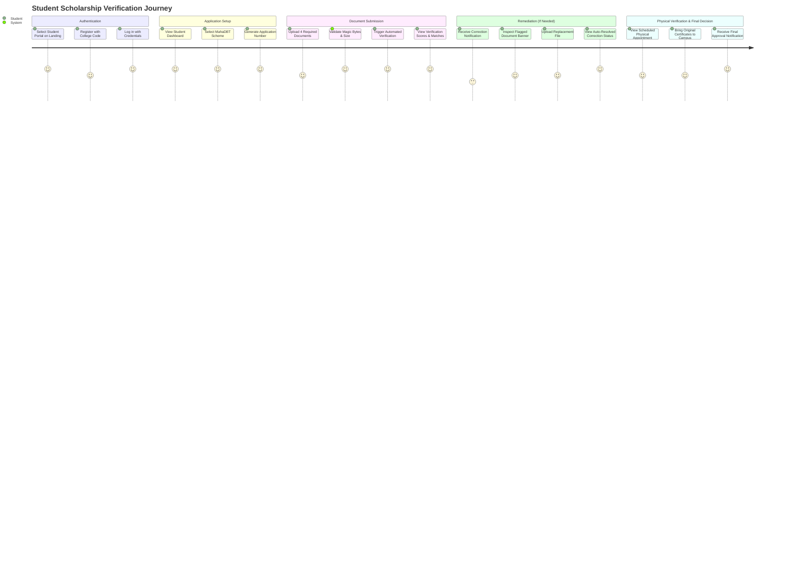
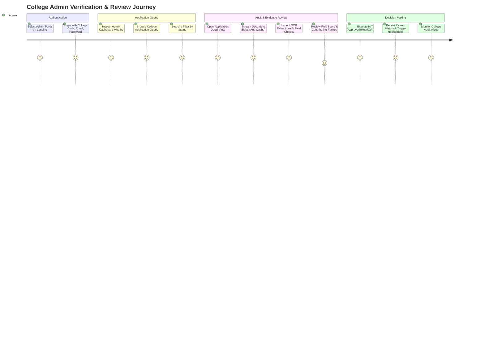

# VeriCampus AI — UI/UX Design System Specification

**Document Version:** 1.0.0  
**Status:** Approved / Active Baseline  
**Project Path:** `C:\veriicampus prerequisites`  
**Last Updated:** September 2026  

---

## 1. Design Philosophy & Aesthetic Principles

VeriCampus AI is designed as an institutional-grade, high-trust academic verification portal. Its visual and interaction design embodies five core principles:

1. **Academic Trust & Authority:** Visual hierarchy and restrained styling instill confidence in both collegiate administrative officers and student applicants handling high-stakes educational credentials.
2. **Clarity Over Clutter:** Dense regulatory scholarship rules and multi-document comparisons are distilled into scannable cards, clean data grids, and color-coded status badges.
3. **Transparent Decision-Support:** AI verification scores, OCR extractions, and review-risk metrics are presented with explicit institutional disclaimers, reinforcing that algorithms provide decision assistance while human officers retain final authority.
4. **Frictionless Remediation:** When documents are flagged for correction or physical inspection is scheduled, actionable instructions and original document checklists are highlighted prominently.
5. **Harmonious "Ocean Depths" Palette:** A maritime aesthetic combining deep navy, slate, teal, and seafoam provides contrast, legibility, and visual calm.

---

## 2. Color Palette — Ocean Depths Theme

The application's color theme is defined in `tailwind.config.js` under the custom `Ocean Depths` specification:

```
┌─────────────────────────────────────────────────────────────┐
│                       OCEAN DEPTHS                          │
├─────────────────┬─────────────────┬─────────────────────────┤
│ Deep Navy       │ #1a2332         │ Primary Brand & Headers │
│ Navy Light      │ #243044         │ Secondary Headers / Nav │
│ Teal            │ #2d8b8b         │ Primary Action / Accent │
│ Teal Hover      │ #247070         │ Interactive Button Hover│
│ Teal Light      │ #e6f3f3         │ Subtle Active Background│
│ Seafoam         │ #a8dadc         │ Secondary Accent        │
│ Seafoam Light   │ #eaf6f6         │ Card / Pill Highlights  │
│ Cream           │ #f1faee         │ Warm Canvas Background  │
└─────────────────┴─────────────────┴─────────────────────────┘
```

### 2.1 Color Definitions & Hex Values

| Token | Hex Value | Usage in Current Codebase |
| :--- | :--- | :--- |
| `navy.DEFAULT` | `#1a2332` | Top Navbar background, primary card headings, authoritative labels. |
| `navy.light` | `#243044` | Navbar buttons, secondary surfaces, active nav hover states. |
| `navy.dark` | `#121824` | High-contrast text, dark modal backdrops. |
| `teal.DEFAULT` | `#2d8b8b` | Primary call-to-action buttons, active sidebar borders, check icons. |
| `teal.hover` | `#247070` | Button hover states, interactive link transitions. |
| `teal.light` | `#e6f3f3` | Subtle badge backgrounds, highlight card borders. |
| `seafoam.DEFAULT`| `#a8dadc` | Logo accent text, subtle borders, progress stepper indicators. |
| `seafoam.light` | `#eaf6f6` | Application badge backgrounds, selected filter pill backgrounds. |
| `cream.DEFAULT` | `#f1faee` | Page canvas backgrounds, contrast card backgrounds. |

### 2.2 Semantic & State Color Tokens

| Semantic Role | Foreground / Border | Background | Usage |
| :--- | :--- | :--- | :--- |
| **Success / Verified** | Emerald-700 (`#047857`) / Emerald-200 | Emerald-50 (`#ecfdf5`) | Status: `VERIFIED`, `APPROVED`, `PASS`, `RESOLVED`. |
| **Warning / Action Needed** | Amber-800 (`#92400e`) / Amber-300 | Amber-50 (`#fffbeb`) | Status: `NEEDS_REVIEW`, `WARNING`, `FLAGGED`, Correction callouts. |
| **Danger / Rejected** | Rose-700 (`#be123c`) / Rose-200 | Rose-50 (`#fff1f2`) | Status: `REJECTED`, `FAIL`, Unread notification badge, error banners. |
| **Info / Scheduled** | Teal-700 (`#0f766e`) / Teal-200 | Teal-50 (`#f0fdfa`) | Status: `PHYSICAL_VERIFICATION_REQUIRED`, `SCHEDULED`. |
| **Neutral / Draft** | Slate-700 (`#334155`) / Slate-200 | Slate-100 (`#f1f5f9`) | Status: `DRAFT`, `PENDING`, `UPLOADED`, `SUBMITTED`. |

---

## 3. Typography & Text Hierarchy

The platform uses the native system sans-serif font stack backed by **Inter**:
```css
fontFamily: ['Inter', 'system-ui', '-apple-system', 'sans-serif']
```

| Element | Tailwind Classes | Purpose |
| :--- | :--- | :--- |
| **Page Header (H1)** | `text-2xl font-bold text-navy` | Main page titles (e.g. Student Dashboard, All Applications). |
| **Section Header (H2)** | `text-xl font-bold text-navy` | Sub-sections, card headers, review panels. |
| **Card Header (H3)** | `text-base sm:text-lg font-semibold text-navy` | Document card titles, appointment blocks, stepper headers. |
| **Sub-Header / Label (H4)** | `text-sm font-bold text-navy` | Field labels, modal labels, notification titles. |
| **Body Text** | `text-sm text-slate-600` | Explanatory paragraphs, instructions, table contents. |
| **Metadata / Secondary** | `text-xs text-slate-500` | Subtitles, timestamp indicators, file sizes, helper notes. |
| **Micro Labels / Badges** | `text-[10px] sm:text-[11px] font-semibold tracking-wider uppercase` | Status pills, unread count badges, scheme indicators. |

---

## 4. Spacing, Layout & Grid System

- **Container Constraint:** Top-level content wrappers enforce `max-w-7xl mx-auto px-4 sm:px-6 lg:px-8`.
- **Top Navigation Bar (`Navbar.jsx`):** Fixed height `h-16`, sticky at top (`sticky top-0 z-40`), dark navy background (`bg-navy text-white shadow-md`).
- **Sidebar Navigation (`Sidebar.jsx`):** Fixed width `w-64`, background `bg-white`, right border `border-r border-slate-200`, vertical height `min-h-[calc(100vh-4rem)]`.
- **Content Padding:** Main views utilize `p-6 sm:p-8 space-y-6` with standardized card border-radius `rounded-2xl` and borders `border border-slate-200 shadow-sm`.
- **Grids:**
  - Metrics Cards: `grid grid-cols-1 sm:grid-cols-2 lg:grid-cols-4 gap-4`.
  - Document Upload / Audit Cards: `grid grid-cols-1 md:grid-cols-2 gap-6`.
  - Inspection & Decision Actions: `grid grid-cols-1 sm:grid-cols-2 lg:grid-cols-4 gap-3`.

---

## 5. UI Component Specifications

### 5.1 Status Badges (`StatusBadge.jsx`)
A centralized component rendering consistent visual badges across all 18 backend workflow states:

```
[ ✔ VERIFIED ]       Emerald: bg-emerald-50 text-emerald-700 border-emerald-200
[ ⚠ NEEDS REVIEW ]   Amber:   bg-amber-50 text-amber-700 border-amber-200
[ ✖ REJECTED ]       Rose:    bg-rose-50 text-rose-700 border-rose-200
[ 📅 PHYSICAL REQ ]  Teal:    bg-teal/10 text-teal border-teal/20
[ 📄 DRAFT ]         Slate:   bg-slate-100 text-slate-700 border-slate-200
[ ⚡ SUBMITTED ]     Blue:    bg-blue-50 text-blue-700 border-blue-200
```

### 5.2 Document Card (`DocumentCard.jsx`)
The primary document interaction surface:
- **Header:** Document type title with icon (`CreditCard` for ID, `GraduationCap` for Marksheet, `FileSpreadsheet` for Income, `Home` for Domicile).
- **Status Badge:** Indicates `UPLOADED`, `PENDING`, or `NOT_UPLOADED`.
- **File Metadata:** Displays uploaded filename, formatted file size in MB, and timestamp.
- **Correction Alert Box:** Rendered if the document is flagged under an active correction request. Displays amber border, officer's instruction reason, and a prominent "Replace Document" CTA button.
- **Actions:**
  - "View / Download Document": Triggers secure authenticated blob streaming in modal/new tab.
  - "Replace File": Hidden file input with drag-and-drop support.
  - "Use Demo Document": Quick 1-click test file loader during local development evaluation.

### 5.3 Review Action Modals (`ApplicationDetailPage.jsx`)
Human-in-the-loop decision modals triggered by authorized college administrators:
1. **Approve Modal:** Confirms 4-document presence and allows optional officer remarks.
2. **Request Correction Modal:** Multi-select checkboxes for the 4 documents and a mandatory text area for the justification reason (enforces $\ge 5$ characters with live character counter).
3. **Require Physical Verification Modal:** Date picker (enforces today or future), time input, venue input, and officer instructions text area.
4. **Complete Physical Verification Modal:** Radio selection (`VERIFIED` vs `NOT_VERIFIED`) and mandatory officer inspection notes ($\ge 3$ characters).
5. **Reject Modal:** High-visibility danger modal with mandatory justification reason ($\ge 5$ characters).

### 5.4 Navigation Elements (`Navbar.jsx` & `Sidebar.jsx`)
- **Top Navbar:**
  - VeriCampus AI logo with shield icon.
  - Role pill: `ADMINISTRATOR` (amber badge) or `STUDENT` (seafoam badge).
  - Authenticated user name and email.
  - Clickable Notification Bell with red unread counter badge (`unreadCount`).
  - Logout button.
- **Sidebar:**
  - Role portal title (`Student Scholarship Portal` or `Admin Workflow Portal`).
  - Nav links with Lucide icons. Active link indicated by deep navy text, seafoam-light background, and a left 4px teal accent border (`border-l-4 border-teal`).
  - Unread count pill badge on "Notifications" or "Audit Alerts" nav item.
  - Bottom card indicating OCR & Rules Engine active status.

---

## 6. User Experience (UX) Journeys

### 6.1 Student User Journey



1. **Entry & Login:** Student accesses `/student-login` (or registers at `/student-register` with their assigned `college_code`, e.g., `DEMO001`).
2. **Dashboard Overview:** Lands on `/student/dashboard`. If no application exists, prompted with a prominent "Start New Application" CTA.
3. **Scheme Selection:** Navigates to `/student/select-scholarship`. Browses 8 authoritative MahaDBT schemes, reviews income ceilings and eligibility criteria, and clicks "Select & Apply".
4. **Document Upload:** Navigates to `/student/documents`. Uploads all 4 required certificates. Each card updates dynamically from empty state to `UPLOADED` with file size and timestamp.
5. **Verification & Audit Inspection:** Navigates to `/student/verification`. Clicks "Trigger AI Verification". Multi-step animated stepper runs, persisting score, field check results, cross-document matches, and risk tier.
6. **Remediation:** If the reviewing officer flags a certificate, an amber alert banner appears on Dashboard and Document Upload page with the officer's exact instructions. Student clicks "Replace File", uploads the new scan, and the status resolves automatically.
7. **Appointment Tracking:** Navigates to `/student/appointment`. If physical verification is scheduled, inspects date, time, venue, officer notes, and original physical document checklist.
8. **Notifications:** Navigates to `/student/notifications`. Views chronological audit log, toggles read status, or clicks "Mark all as read".

---

### 6.2 Admin User Journey



1. **Admin Login:** Accesses `/admin-login`. Authenticates using `college_code` + `email` + `password`.
2. **Metrics Dashboard:** Lands on `/admin/dashboard`. Reviews total college caseload, verified count, pending reviews, physical verifications queue, and rejection rate.
3. **Application Queue:** Navigates to `/admin/applications`. Filters applications by status (`SUBMITTED`, `NEEDS_REVIEW`, `VERIFIED`, etc.) or searches by student name / application number.
4. **Detailed Audit View:** Clicks "Review Application" to enter `/admin/applications/:id`.
   - Inspects student profile, enrolled college, and application tracking number.
   - Streams and previews all 4 documents in secure modal viewer.
   - Evaluates OCR-extracted data against student-entered claims.
   - Inspects RulesEngine cross-document matrix (`NameMatcher` similarity, DOB match, Maharashtra domicile confirmation, income check).
   - Reviews prototype review-risk card (Risk score 0–100, risk level `LOW`/`MEDIUM`/`HIGH`, and contributing factors).
   - Reads historical review timeline and past correction requests.
5. **Human Decision Execution:** Clicks one of four decision buttons:
   - **Approve:** Transitions status to `VERIFIED`.
   - **Request Correction:** Selects specific document(s) and provides mandatory written justification.
   - **Schedule Physical Verification:** Selects date, time, venue, and instructions.
   - **Record Physical Verification:** Logs in-person inspection notes and marks `VERIFIED` or `NOT_VERIFIED`.
   - **Reject:** Enters official justification reason and transitions status to `REJECTED`.
6. **Audit Alerts Log:** Navigates to `/admin/notifications`. Reviews college-wide audit alerts, unread counts, and real-time event logs.

---

## 7. Accessibility & Responsive Guidelines

1. **Color Contrast:** All text color pairings against white and slate backgrounds meet WCAG AA contrast standards ($\ge 4.5:1$).
2. **Keyboard Navigation:** All buttons, modal triggers, and form fields are fully focusable with visible focus rings (`focus:ring-2 focus:ring-teal/20 focus:border-teal`).
3. **Responsive Breakpoints:**
   - Mobile ($< 640\text{px}$): Single-column cards, collapsible sidebar, horizontal scroll data tables.
   - Tablet ($640\text{px} - 1024\text{px}$): Two-column grids, optimized modal layouts.
   - Desktop ($\ge 1024\text{px}$): Full two-column and four-column layouts with fixed sidebar navigation.
4. **Screen-Reader Semantics:** Modals utilize proper ARIA roles, input labels explicitly wrap or reference controls, and status pills contain readable text labels rather than relying solely on iconography.
