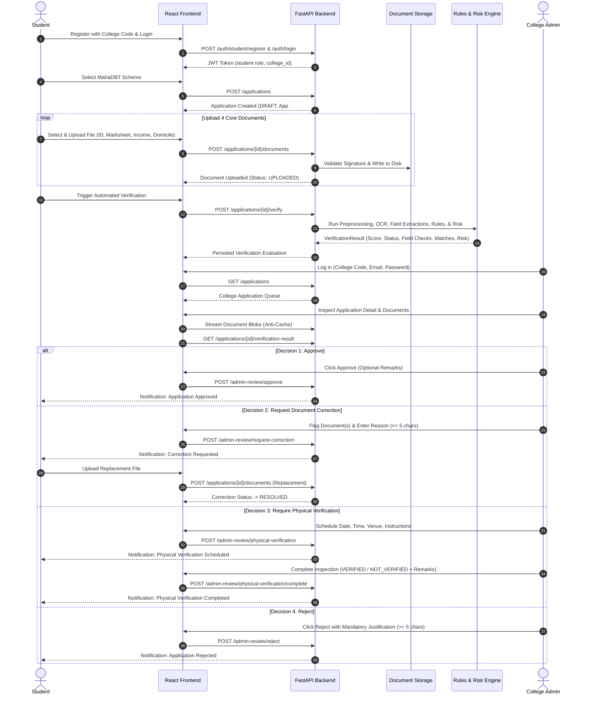

# VeriCampus AI — Product Requirements Document (PRD)

**Document Version:** 1.0.0  
**Status:** Approved / Active Baseline  
**Project Path:** `C:\veriicampus prerequisites`  
**Last Updated:** September 2026  

---

## 1. Executive Summary & Product Purpose

**VeriCampus AI** is an AI-assisted scholarship document verification and workflow automation platform. Designed for Indian higher education institutions operating under government scholarship regimes (such as Maharashtra’s MahaDBT portal), VeriCampus AI eliminates manual clerical bottlenecks, accelerates application verification turnaround, and prevents fraudulent or duplicate claims through automated document preprocessing, Optical Character Recognition (OCR), deterministic cross-document consistency checks, and explainable prototype risk analysis.

The system strictly implements a **Human-in-the-Loop (HITL)** operational model: AI, OCR, and risk scoring serve purely as assistive decision-support tools. Final administrative decisions—approvals, rejections, correction requests, and physical verification mandates—are exclusively executed by authorized college administrative officers.

---

## 2. Problem Statement & Opportunities

### 2.1 The Problem
- **Manual Verification Overhead:** College scholarship cells process hundreds to thousands of student applications each academic semester. Verification officers manually scrutinize paper photocopies and low-resolution scans across multiple certificates (Aadhaar, HSC/SSC marksheets, Tahsildar income certificates, and domicile certificates).
- **Human Clerical Errors:** Subtle discrepancies—such as minor spelling variations in student names across documents, mismatched dates of birth, or family incomes exceeding government scheme thresholds—are easily overlooked under heavy caseloads.
- **Student Friction & Lack of Transparency:** When errors occur, communication is fragmented. Students frequently discover application rejections weeks later with vague rejection reasons and no guided remediation pathway.
- **Multi-Tenant Security Concerns:** Colleges require strict isolation so that administrative officers cannot view, tamper with, or decide upon applications belonging to other institutions.

### 2.2 Product Opportunity
VeriCampus AI provides an automated, multi-tenant digital verification conduit that:
1. Ingests required official documents in standard digital formats (PDF, PNG, JPG).
2. Performs automated integrity and magic-byte signature validation.
3. Automatically extracts key identity, academic, and financial fields using OCR.
4. Deterministically cross-references extracted data against official scheme eligibility rules.
5. Surfaces potential discrepancies and an explainable risk score to the reviewing officer.
6. Enforces structured correction workflows, in-person physical verification scheduling, and complete audit histories.

---

## 3. Target Users & Stakeholders

| Role | Description | Primary Responsibilities |
| :--- | :--- | :--- |
| **Student** *(Applicant)* | Enrolled college student applying for government scholarship schemes. | Register with verified college code; select scheme; upload required certificates; review automated verification feedback; replace flagged documents; view physical verification appointments; track application status and notifications. |
| **College Admin Officer** *(Reviewer)* | Dedicated institutional scholarship officer bound to a single college. | Securely login via college code; review college-specific application queues; inspect uploaded documents, OCR extractions, field check matrices, and risk scores; approve, reject, request document corrections, or schedule/record physical verification sessions. |
| **Institutional Leadership** *(Stakeholder)* | Principals, Registrars, and Deans monitoring compliance. | Ensure audit compliance, maintain zero cross-college data leaks, and monitor institutional scholarship processing metrics. |

---

## 4. Product Goals & Success Metrics

1. **Deterministic Accuracy:** Catch 100% of critical scheme eligibility violations (income exceeding limit, non-domicile, missing mandatory certificates) prior to human review.
2. **Turnaround Reduction:** Reduce officer review time per application from 25–30 minutes to under 5 minutes by pre-extracting fields and highlighting discrepancies.
3. **Data Isolation & Compliance:** Zero cross-tenant data leakage across colleges; strict student ownership of private application data.
4. **Transparent Remediation:** 100% of document correction requests must contain specific flagged document types and officer justification reasons of at least 5 characters.
5. **Human-in-the-Loop Integrity:** 0% automated approvals or rejections; every decisive workflow transition requires an authenticated human administrator signature.

---

## 5. Scope & Feature Matrix

The following table distinguishes features that are **CURRENTLY IMPLEMENTED** in the codebase from **PLANNED / FUTURE** functionality:

| Feature / Capability | Implementation Status | Implementation Details / Reference |
| :--- | :--- | :--- |
| **Multi-College Tenancy** | **CURRENTLY IMPLEMENTED** | `College` model; database foreign keys; unique setup codes. |
| **JWT Authentication & Passwords** | **CURRENTLY IMPLEMENTED** | Salted bcrypt; HS256 JWT access tokens; embedded `college_id` claim. |
| **Student Registration & Login** | **CURRENTLY IMPLEMENTED** | Bound to valid `college_code`; duplicate email protection. |
| **Admin Setup & Login** | **CURRENTLY IMPLEMENTED** | Setup code registration; login with `college_code` + `email` + `password`. |
| **Official MahaDBT Schemes** | **CURRENTLY IMPLEMENTED** | 8 authoritative Maharashtra schemes in `MAHADBT_SCHEMES`. |
| **1-Application per Student Rule** | **CURRENTLY IMPLEMENTED** | Database `UNIQUE` constraint on `ScholarshipApplication.student_id`. |
| **Core 4-Document Requirement** | **CURRENTLY IMPLEMENTED** | Aadhaar/Govt ID, Marksheet, Income Certificate, Domicile Certificate. |
| **File Validation & Magic Bytes** | **CURRENTLY IMPLEMENTED** | 2.5 MiB max size; PDF/JPG/PNG MIME and binary signature checks. |
| **Document Replacement Flow** | **CURRENTLY IMPLEMENTED** | Safe file overwrite with rollback; automatic correction resolution. |
| **Anti-Cache Document Streaming** | **CURRENTLY IMPLEMENTED** | `Cache-Control: no-cache, no-store`, `Pragma: no-cache`, `Expires: 0`. |
| **Document Preprocessing & OCR** | **CURRENTLY IMPLEMENTED** | OpenCV / Pillow / PyMuPDF pipeline; PaddleOCR and Mock providers. |
| **Structured Field Extraction** | **CURRENTLY IMPLEMENTED** | Dedicated extractors for all 4 document types into typed Pydantic models. |
| **Cross-Document Rules Engine** | **CURRENTLY IMPLEMENTED** | Fuzzy name similarity (`NameMatcher`), DOB matching, income & percentage checks. |
| **Prototype Risk Analysis** | **CURRENTLY IMPLEMENTED** | `RiskService`: non-PII feature builder + explainable rule-based risk model. |
| **Administrative Decision Actions** | **CURRENTLY IMPLEMENTED** | Approve, Request Correction, Schedule Physical, Record Inspection, Reject. |
| **Persistent Notification System** | **CURRENTLY IMPLEMENTED** | Database `Notification` model, Alembic migration, 8 workflow triggers, read tracking. |
| **Multi-College Tenant Isolation** | **CURRENTLY IMPLEMENTED** | Enforced at DB query level; HTTP 403 on cross-college access. |
| **Cloud Object Storage (AWS S3)** | **PLANNED / FUTURE** | Currently stores on secure local filesystem (`backend/storage/`). |
| **DigiLocker / Aadhaar e-KYC API** | **PLANNED / FUTURE** | Planned direct integration with national identity APIs. |
| **Multi-Application History** | **PLANNED / FUTURE** | Historical submissions across multiple academic years. |
| **Real-Time Push Notifications** | **PLANNED / FUTURE** | WebSockets or Server-Sent Events (SSE); currently REST polling/refresh. |
| **Automated Government Batch Sync**| **PLANNED / FUTURE** | Direct API sync with state MahaDBT database. |

---

## 6. Detailed Scholarship Application Workflow

---

## 7. Supported Scholarship Schemes

The platform supports the following 8 official Maharashtra MahaDBT scholarship schemes:

1. **Post Matric Scholarship to VJNT Students**
   - Income Threshold: $\le \text{₹}1,50,000 / \text{year}$
   - Academic Percentage Threshold: None
   - Domicile: State of Maharashtra required
2. **Post Matric Scholarship to OBC Students**
   - Income Threshold: $\le \text{₹}1,50,000 / \text{year}$
   - Academic Percentage Threshold: None
   - Domicile: State of Maharashtra required
3. **Post Matric Scholarship to SBC Students**
   - Income Threshold: $\le \text{₹}1,50,000 / \text{year}$
   - Academic Percentage Threshold: None
   - Domicile: State of Maharashtra required
4. **Post Matric Scholarship to the Girls Belonging to Other Backward Classes taking admission in Professional Courses**
   - Income Threshold: $\le \text{₹}8,00,000 / \text{year}$
   - Academic Percentage Threshold: None
   - Domicile: State of Maharashtra required
5. **Rajarshi Chhatrapati Shahu Maharaj Shikshan Shulkh Shishyavrutti Yojna (EBC)**
   - Income Threshold: $\le \text{₹}8,00,000 / \text{year}$
   - Academic Percentage Threshold: $\ge 50.0\%$
   - Domicile: State of Maharashtra required
6. **Dr. Panjabrao Deshmukh Vasatigruh Nirvah Bhatta Yojna (DTE)**
   - Income Threshold: $\le \text{₹}8,00,000 / \text{year}$
   - Academic Percentage Threshold: $\ge 50.0\%$
   - Domicile: State of Maharashtra required
7. **State Minority Scholarship Part II (DHE)**
   - Income Threshold: $\le \text{₹}8,00,000 / \text{year}$
   - Academic Percentage Threshold: $\ge 50.0\%$
   - Domicile: State of Maharashtra required
8. **Scholarship for students of minority communities pursuing Higher and Professional courses (DTE)**
   - Income Threshold: $\le \text{₹}8,00,000 / \text{year}$
   - Academic Percentage Threshold: $\ge 50.0\%$
   - Domicile: State of Maharashtra required

---

## 8. Required Documents & Extraction Schemas

All scholarship applications require the upload of exactly four core documents:

### 1. Government ID / Aadhaar (`GOVERNMENT_ID`)
- **Document Purpose:** Proof of identity and residential address.
- **Extracted Fields:**
  - `id_type`: Identification type (`AADHAAR`, `PAN`, `VOTER_ID`).
  - `id_number`: Government identity number.
  - `full_name`: Candidate name as printed on ID.
  - `date_of_birth`: Date of birth (`YYYY-MM-DD` or printed string).
  - `gender`: Gender (`MALE`, `FEMALE`, `OTHER`).
  - `address`: Full printed address.

### 2. Academic Marksheet (`MARKSHEET`)
- **Document Purpose:** Proof of academic qualifying examination performance.
- **Extracted Fields:**
  - `candidate_name`: Student full name as certified.
  - `roll_number`: Examination seat / roll number.
  - `exam_name`: Examination title (e.g., HSC, SSC, Class 12).
  - `passing_year`: Year of completion.
  - `total_marks`: Marks obtained.
  - `max_marks`: Maximum marks.
  - `percentage`: Calculated or printed percentage score.
  - `result_status`: Result classification (e.g., `PASS`, `DISTINCTION`).

### 3. Income Certificate (`INCOME_CERTIFICATE`)
- **Document Purpose:** Proof of family annual income for financial eligibility.
- **Extracted Fields:**
  - `applicant_name`: Applicant or head of household.
  - `father_guardian_name`: Father or legal guardian name.
  - `annual_income_inr`: Total family income in Indian Rupees.
  - `certificate_number`: Official certificate serial / bar number.
  - `issuing_authority`: Issuing revenue official (e.g., Tahsildar).
  - `issue_date`: Date of issuance.
  - `financial_year`: Valid financial year (e.g., `2023-2024`).

### 4. Domicile Certificate (`DOMICILE_CERTIFICATE`)
- **Document Purpose:** Proof of residency in the State of Maharashtra.
- **Extracted Fields:**
  - `candidate_name`: Candidate name.
  - `state`: State of residence.
  - `is_maharashtra_domicile`: Boolean confirmation of Maharashtra domicile.
  - `certificate_number`: Certificate serial number.
  - `issue_date`: Date of issuance.

---

## 9. Functional Requirements by Actor

### 9.1 Student Capabilities
- **Registration & Authentication:** Register with full name, email, password, phone, and target `college_code`. Login to obtain signed JWT token.
- **College Association:** Firmly bound to a single institution; cannot access or submit to other colleges.
- **Application Creation:** Select from 8 authoritative MahaDBT schemes; generates unique application tracking number (`APP-YYYYMMDD-XXXX`).
- **Document Management:** Upload 4 required core certificates with client-side and server-side validation.
- **Document Replacement:** Seamlessly re-upload a replacement file if flagged by admin; replacement updates active document, cleans up previous file, and preserves audit trail.
- **Verification Trigger & Results:** Trigger automated verification; inspect OCR extractions, check scores, match tables, and risk ratings.
- **Physical Verification Tracking:** View scheduled appointment details (date, time, venue, officer instructions) and checklist of original physical certificates.
- **Notifications & Alerts:** View chronological notifications timeline; toggle read/unread; mark all as read.

### 9.2 Admin Capabilities
- **Institutional Authentication:** Authenticate using `college_code` + `email` + `password`. Setup new admin account via private one-time `admin_setup_code`.
- **Tenant-Isolated Queue:** View only applications belonging to the officer's authorized college. Filter by application status and search by student name or application number.
- **Audit Detail View:** Review complete student profile, application metadata, and uploaded documents.
- **Secure Document Streaming:** View/download document files securely through authenticated blob streaming with anti-cache directives.
- **AI/OCR Evaluation Inspection:** Review composite scores, OCR-extracted fields per document, field check matrices, and cross-document similarity matches.
- **Risk Analysis Inspection:** View 0–100 risk score, risk level (`LOW`, `MEDIUM`, `HIGH`), and contributing risk factors.
- **Four Administrative Decisions:**
  1. **Approve:** Verify application when all 4 documents are valid and criteria are met.
  2. **Request Correction:** Flag specific document(s) with mandatory written justification ($\ge 5$ characters).
  3. **Schedule Physical Verification:** Set appointment date, time, venue, and instructions.
  4. **Record Physical Verification:** Record inspection result (`VERIFIED` / `NOT_VERIFIED`) with officer notes.
  5. **Reject:** Reject application with mandatory justification reason ($\ge 5$ characters).
- **Notifications & Audit Alerts:** Receive real-time system alerts on application submissions, document replacements, verification completions, and workflow actions.

---

## 10. Automated Verification & Rules Engine

### 10.1 OCR & Field Extraction
- **Image Preprocessing:** Grayscale conversion, Otsu thresholding, skew correction, and DPI resizing via OpenCV and Pillow. PyMuPDF (`fitz`) handles PDF rasterization.
- **Extraction Engines:** Pluggable `BaseAIVerifier` interface with:
  - `PaddleOCRVerifier`: Real local OCR extraction using PaddleOCR and regex-based document extractors.
  - `MockAIVerifier`: Deterministic test engine producing structured extractions without external dependencies.

### 10.2 Cross-Document Consistency Checks
- **Candidate Name Matching:** `NameMatcher` evaluates student name similarity across all 4 documents using token set ratio, Levenshtein distance, initials expansion, and honorific stripping (`Mr`, `Ms`, `Shri`, `Kumari`).
  - Score $\ge 85\%$: `PASS`
  - Score $70\% - 84\%$: `WARNING`
  - Score $< 70\%$: `FAIL`
- **Date of Birth Consistency:** Compares birth dates between Government ID and academic marksheets.
- **Domicile Confirmation:** Enforces that state must equal `Maharashtra` and `is_maharashtra_domicile` is True.
- **Income Ceiling Verification:** Validates that `annual_income_inr` does not exceed the scheme's statutory ceiling (₹1,50,000 or ₹8,00,000).
- **Academic Performance Check:** Validates that student percentage satisfies minimum threshold ($\ge 50\%$ where applicable).

### 10.3 Prototype Review-Risk Analysis
- **Non-PII Feature Extraction:** `FeatureBuilder` extracts 11 explainable heuristic features:
  - Discrepancy counts (name mismatch count, DOB mismatch count).
  - Document readability scores.
  - Income limit headroom ratio.
  - Marksheet percentage gap.
  - Missing document count.
- **Explainable Classification:** `PrototypeRuleBasedRiskModel` categorizes risk into:
  - `LOW` (Risk Score 0–29): High data consistency, clear eligibility.
  - `MEDIUM` (Risk Score 30–69): Minor name variations, borderline income or percentage.
  - `HIGH` (Risk Score 70–100): Direct eligibility breach, unreadable certificates, critical name mismatch.

---

## 11. Security, Tenancy & Compliance

1. **Multi-College Tenant Isolation:**
   - Every database query for applications, documents, appointments, and notifications filters strictly by `college_id`.
   - Cross-college access attempts immediately return `HTTP 403 Forbidden`.
2. **Student Data Ownership:**
   - Students can access only applications and appointments where `student_id == token.sub`.
   - Attempts to access other students' records return `HTTP 403 Forbidden`.
3. **Protected Document Storage & Streaming:**
   - Internal filesystem storage paths (`storage_path`) are never returned in JSON API responses.
   - Documents are streamed via `GET /applications/{id}/documents/{doc_id}/file` requiring valid Bearer JWT.
   - Streaming responses enforce strict anti-cache headers: `Cache-Control: no-cache, no-store, must-revalidate, private`, `Pragma: no-cache`, `Expires: 0`.
4. **Binary Signature Validation:**
   - Uploaded files must match magic byte signatures (`%PDF-`, `\xff\xd8\xff`, `\x89PNG\r\n\x1a\n`) preventing disguised executable uploads.
5. **Path Traversal Protection:**
   - Sanitized filenames and `Path.is_relative_to(base_dir)` validation prevent directory traversal exploits.
6. **Cryptographic Protection:**
   - Salted bcrypt hashing for all passwords.
   - Signed HS256 JWT access tokens with 24-hour expiration.

---

## 12. Current Limitations & Known Constraints

1. **One Application Per Student:** In the current prototype database schema, a student may hold exactly one active scholarship application at a time (`student_id` is unique in `scholarship_applications`).
2. **One Admin Officer Per College:** The schema enforces a strict 1-to-1 relationship between `colleges` and `admin_officers`.
3. **Local Filesystem Storage:** Document files are stored on local disk under `backend/storage/applications/`. Distributed cloud storage (AWS S3 or Google Cloud Storage) is not yet implemented.
4. **OCR Default Verifier:** `VerificationService` defaults to `MockAIVerifier` unless explicitly injected with `PaddleOCRVerifier`, ensuring that local test environments without PaddleOCR run without crashing.
5. **Non-Trained Risk Model:** The risk analysis engine is an expert heuristic rule-based model. It deliberately does not train machine learning models on live student PII.
6. **No Automated Approvals:** The system cannot and will not approve or reject applications autonomously; human administrator review is mandatory.
